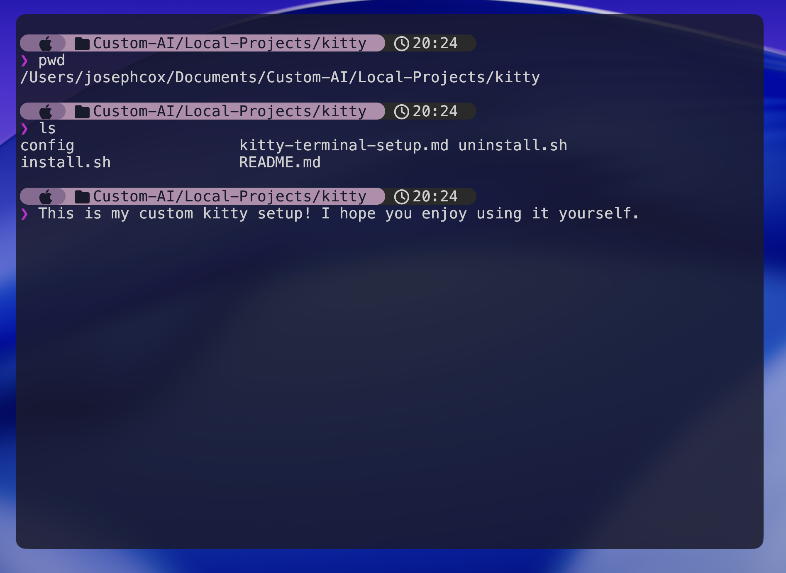

# Kitty Terminal Setup

A beautiful, minimal kitty terminal configuration with transparency, powerline tabs, and a custom Starship prompt.



## Features

- Translucent terminal window with hidden title bar
- Purple powerline-style tab bar
- Custom prompt with Apple logo, directory, and clock
- Nerd Font icons throughout
- Easy one-command installation

## Quick Install

```bash
git clone https://github.com/YOUR_USERNAME/kitty-terminal-setup.git
cd kitty-terminal-setup
./install.sh
```

## What Gets Installed

| Component | Description |
|-----------|-------------|
| [Kitty](https://sw.kovidgoyal.net/kitty/) | GPU-accelerated terminal emulator |
| [Starship](https://starship.rs/) | Minimal, fast shell prompt |
| [JetBrains Mono Nerd Font](https://www.nerdfonts.com/) | Font with icon support |

## Prompt Structure

```
[Apple logo] → [folder + path] → [clock + time]
❯
```

## Color Palette

| Element | Hex |
|---------|-----|
| Dark purple (Apple logo) | `#8b6a94` |
| Light purple (directory) | `#b48ead` |
| Dark grey (clock) | `#2a2a2a` |
| Background | `#1a1a2e` |
| Foreground | `#d0d0d0` |

## Customization

### Change transparency

Edit `~/.config/kitty/kitty.conf`:
```conf
background_opacity 0.85  # 0.0 = fully transparent, 1.0 = opaque
```

### Use a background image instead

Replace the transparency line with:
```conf
background_image ~/.config/kitty/background.png
background_image_layout scaled
background_tint 0.85
```

### Change colors

Update the hex values in:
- `~/.config/kitty/kitty.conf` (terminal colors)
- `~/.config/starship.toml` (prompt colors)

## Keyboard Shortcuts

| Action | Shortcut |
|--------|----------|
| New tab | `Cmd+T` |
| Close tab | `Cmd+W` |
| Next tab | `Ctrl+Shift+Right` |
| Previous tab | `Ctrl+Shift+Left` |
| Reload config | `Ctrl+Shift+F5` |

## Uninstall

To remove the configs (and restore any backups):

```bash
./uninstall.sh
```

## Requirements

- macOS
- [Homebrew](https://brew.sh/)

## File Structure

```
.
├── README.md
├── install.sh
├── uninstall.sh
└── config/
    ├── kitty/
    │   └── kitty.conf
    └── starship.toml
```

## License

MIT
